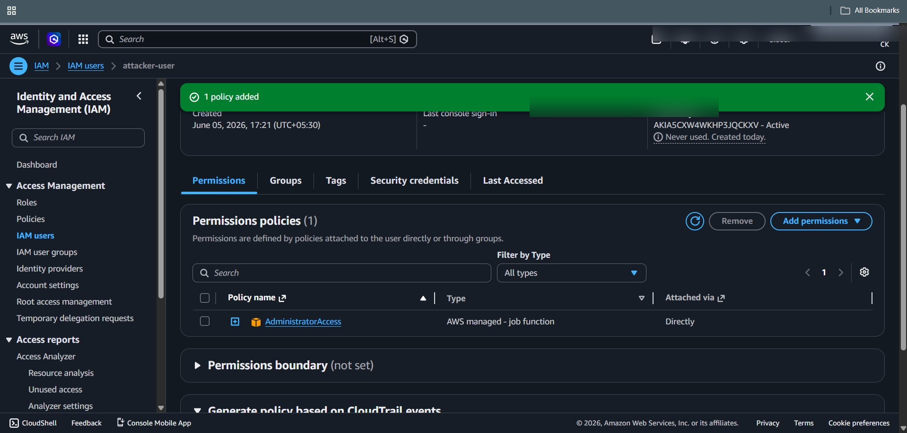

# ⚔️ IAM Policy Modification Attack


## 🎯 Objective

Simulate an attacker modifying IAM permissions to gain elevated privileges.

---

## 🧠 Attack Description

An attacker modifies IAM policies to:

* Gain administrative privileges
* Escalate access
* Control AWS resources

This is one of the most critical attacks in cloud environments.

---

## ⚙️ Attack Steps

### Method 1: Attach Admin Policy

1. Go to AWS Console → IAM
2. Navigate to:

   ```
   Users → Select User → Permissions
   ```
3. Click:

   ```
   Add permissions
   ```
4. Select:

   ```
   Attach policies directly
   ```
5. Choose:

   ```
   AdministratorAccess
   ```
6. Click **Add permissions**

---

### Method 2: Modify Inline Policy (Optional)

1. Go to IAM → User
2. Click:

   ```
   Add inline policy
   ```
3. Add JSON policy granting full access

---

## 📸 Screenshot



---

## 🔍 Logs Generated (CloudTrail)

This attack generates:

```text
eventName=AttachUserPolicy
eventName=PutUserPolicy
eventName=AddUserToGroup
```

---

## 📊 Key Fields

| Field                       | Description      |
| --------------------------- | ---------------- |
| eventName                   | Action performed |
| userIdentity.userName       | Attacker         |
| requestParameters.policyArn | Policy attached  |
| sourceIPAddress             | Source IP        |

---

## 🚨 Why This Is Dangerous

* Full account takeover possible
* Privilege escalation
* Lateral movement
* Resource abuse (EC2, S3, etc.)

---

## 🧠 MITRE ATT&CK Mapping

| Tactic               | Technique            | ID    |
| -------------------- | -------------------- | ----- |
| Privilege Escalation | Account Manipulation | T1098 |

---

---
## 🔗 Navigation

⬅️ Previous Attack:  
👉 **[IAM User Creation](./IAM_User_Creation.md)**

➡️ Detection Rule:  
👉 **[Policy Modification Detection](../Detection_Rules/Policy_Modification_Detection.md)**

➡️ Next Attack:  
👉 **[Access Key Creation](./Access_Key_Creation.md)**

---
