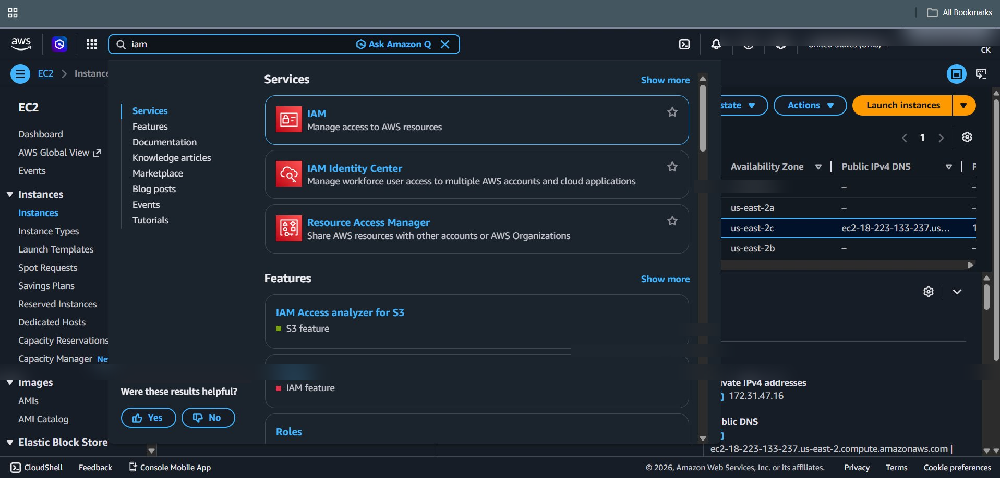
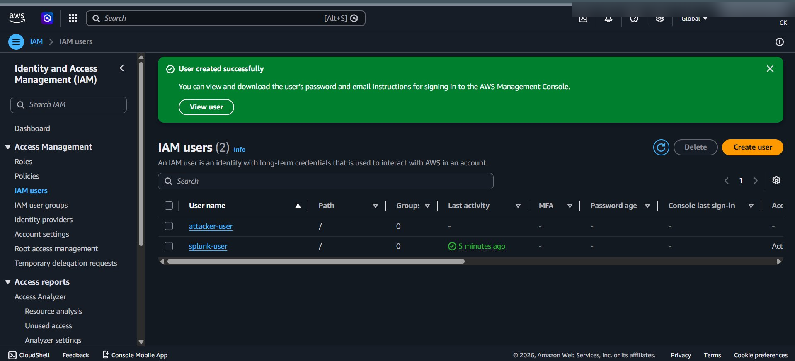

# ⚔️ IAM User Creation Attack


## 🎯 Objective

Simulate an attacker creating a new IAM user to establish persistence within the AWS environment.

---

## 🧠 Attack Description

An attacker with access to AWS creates a new IAM user to maintain long-term access.

This is a common persistence technique used after initial compromise.

---

## ⚙️ Attack Steps

1. Go to AWS Console → IAM
2. Navigate to:

   ```
   Users → Create User
   ```
3. Enter username:

   ```
   attacker-user
   ```
4. Enable:

   * Console access (optional)
5. Attach policy:

   * `AdministratorAccess` (for simulation)

---

## 📸 Screenshot





---

## 🔍 Logs Generated (CloudTrail)

This action generates the following event:

```
eventName=CreateUser
```

---

## 📊 Key Fields

| Field           | Description              |
| --------------- | ------------------------ |
| eventName       | CreateUser               |
| userIdentity    | Who performed the action |
| sourceIPAddress | Attacker IP              |
| eventTime       | Time of attack           |

---

## 🚨 Why This Is Dangerous

* Creates unauthorized access
* Enables persistence
* Can be used for privilege escalation

---

## 🧠 MITRE ATT&CK Mapping

| Tactic      | Technique      | ID    |
| ----------- | -------------- | ----- |
| Persistence | Create Account | T1136 |

---

---
## 🔗 Navigation

➡️ Detection Rule:  
👉 **[IAM User Creation Detection](../Detection_Rules/IAM_User_Creation_Detection.md)**

➡️ Next Attack:  
👉 **[IAM Policy Modification](./IAM_Policy_Modification.md)**

---
