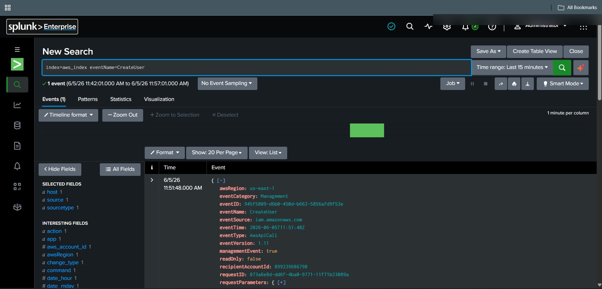
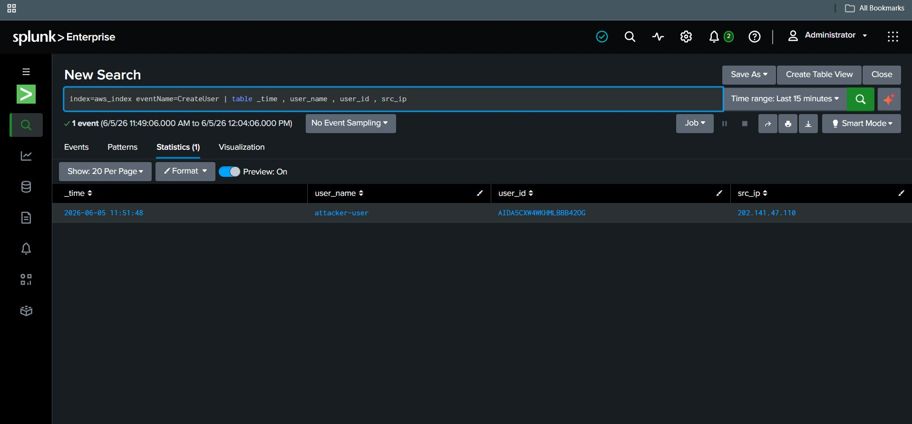
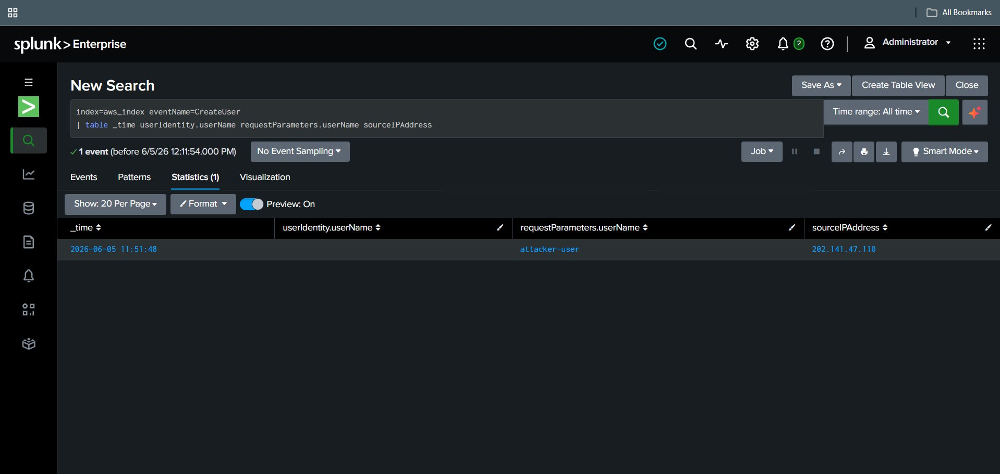
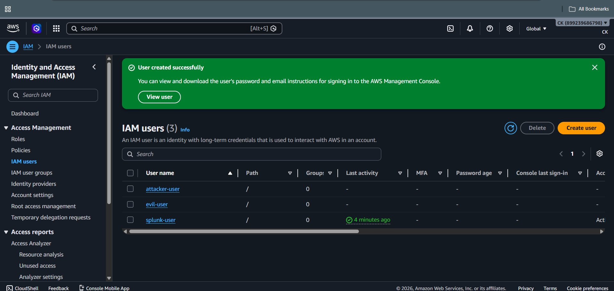
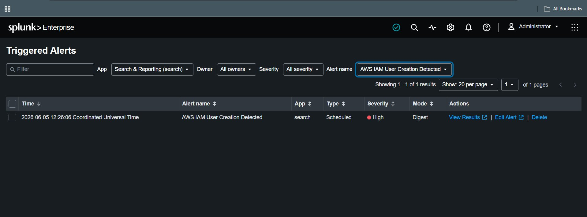

# 🚨 IAM User Creation Detection


## 🎯 Objective

Detect unauthorized creation of IAM users using AWS CloudTrail logs in Splunk.

---

## 🧠 Detection Logic

Whenever a new IAM user is created, AWS CloudTrail generates an event:

```
eventName=CreateUser
```

This event can indicate:

* Legitimate admin activity
* OR attacker persistence attempt

---

## 🔍 Splunk Query (SPL)

```spl
index=aws_index eventName=CreateUser
```

---

## 📊 Improved Detection Query

```spl
index=aws_index eventName=CreateUser
| table _time userIdentity.userName sourceIPAddress requestParameters.userName
```

---

## 📌 Field Explanation

| Field                      | Meaning              |
| -------------------------- | -------------------- |
| _time                      | Time of event        |
| userIdentity.userName      | Who created the user |
| requestParameters.userName | New user created     |
| sourceIPAddress            | Source IP            |

---

## 🚨 Alert Configuration

### Condition

* Trigger when:

```
Number of results > 0
```

### Schedule

* Every 5 minutes

### Time Range

* Last 5 minutes

### Severity

* Medium

---

## 📸 Screenshot











---

## 🔎 SOC Analysis

### Investigate:

* Who created the user?
* Is the IP trusted?
* Was this change authorized?

---

## 🚨 Response Actions

* Disable the IAM user
* Rotate credentials
* Investigate source IP

---

## 🧠 MITRE ATT&CK Mapping

| Tactic      | Technique      | ID    |
| ----------- | -------------- | ----- |
| Persistence | Create Account | T1136 |

---

## 🔗 Related Attack

➡️ `../Attack_Scenarios/IAM_User_Creation.md`
