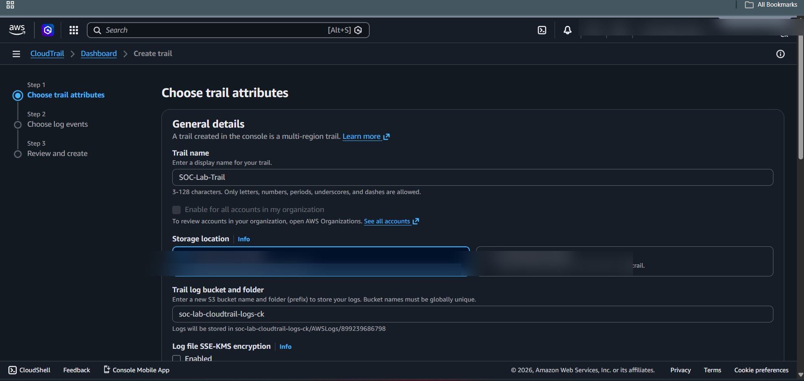
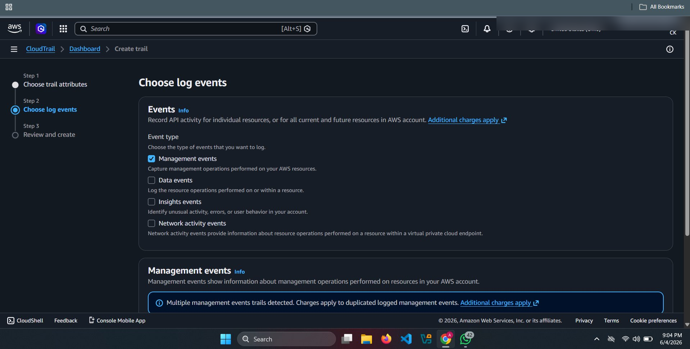
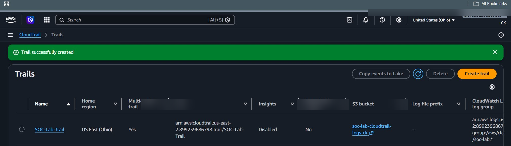

# ☁️ AWS CloudTrail Configuration

## 🎯 Objective

To enable AWS CloudTrail for capturing all API activity across AWS services and forwarding logs for monitoring and detection.

---

## 🧠 Why CloudTrail?

CloudTrail is the **heart of this SOC lab** because it:

- Logs all AWS API calls (who did what)
- Tracks IAM, EC2, S3 activities
- Helps detect suspicious behavior
- Feeds logs into the monitoring pipeline (S3 → SNS → SQS → Splunk)

---

## 🏗️ Architecture Flow

```
AWS Services → CloudTrail → S3 → SNS → SQS → Splunk
```

---

## ⚙️ Configuration Steps

### Step 1: Navigate to CloudTrail

1. Go to AWS Console
2. Search for **CloudTrail**
3. Click **Create Trail**

---

### Step 2: Trail Configuration

- Trail name:
  ```
  SOC-CloudTrail
  ```
- Apply trail to:
  - ✅ All regions (IMPORTANT)

---

### Step 3: Storage Location (S3)

- Create new S3 bucket OR use existing
- Example:
  ```
  soc-cloudtrail-logs-bucket
  ```

---

### Step 4: Enable Log File Validation

- ✅ Enable log file validation  
(ensures logs are not tampered)

---

### Step 5: Enable Management Events

- Read events: ✅ Enabled  
- Write events: ✅ Enabled  

---

### Step 6: Enable Data Events (IMPORTANT)

Add:

- S3 → All buckets
- Lambda (optional)

This helps detect:

- File access
- Object deletion

---

## 📸 Screenshots







---

## 🔍 What Gets Logged?

Examples:

| Action | Event |
|------|------|
| Create IAM User | `CreateUser` |
| Attach Policy | `AttachUserPolicy` |
| Start EC2 | `StartInstances` |
| Stop EC2 | `StopInstances` |
| Delete Logs | `DeleteTrail` |

---

## 🔐 Security Importance

CloudTrail helps detect:

- Privilege escalation
- Unauthorized access
- Resource misuse
- Log tampering attempts

---

## ✅ Validation

After setup:

1. Go to **Event History**
2. Perform an action (e.g., create IAM user)
3. Verify logs appear

---

## 🚨 SOC Insight

CloudTrail logs will later be used to:

- Create detection rules in Splunk
- Trigger alerts via SNS
- Queue messages in SQS

---

## 🔗 Navigation

⬅️ Previous: *Start of Setup*

➡️ Next: [S3 Setup](./S3_Setup.md)
