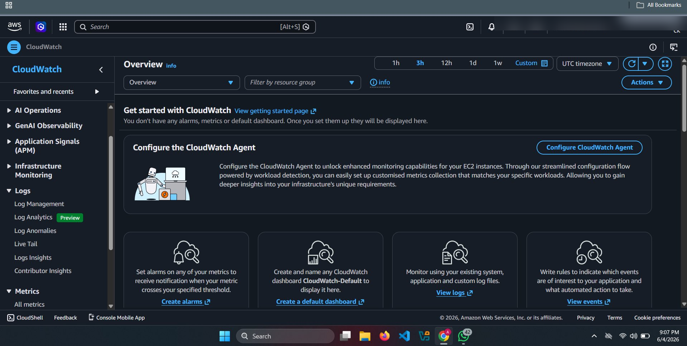
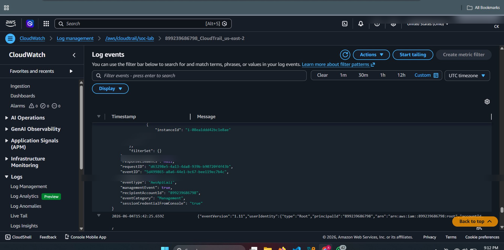
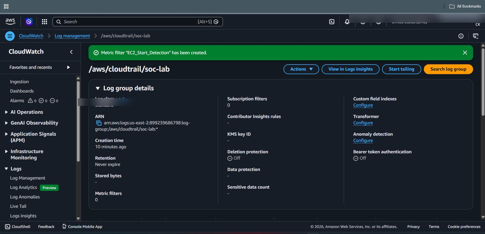
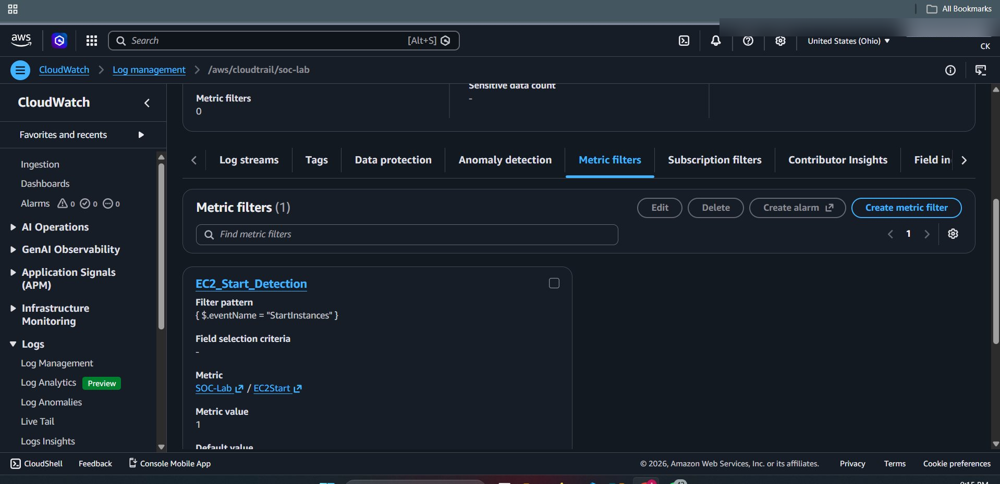
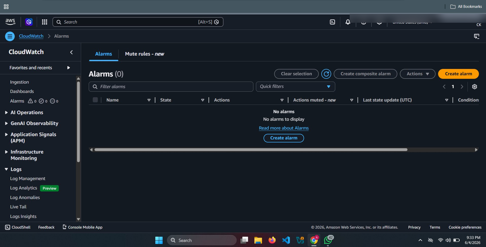
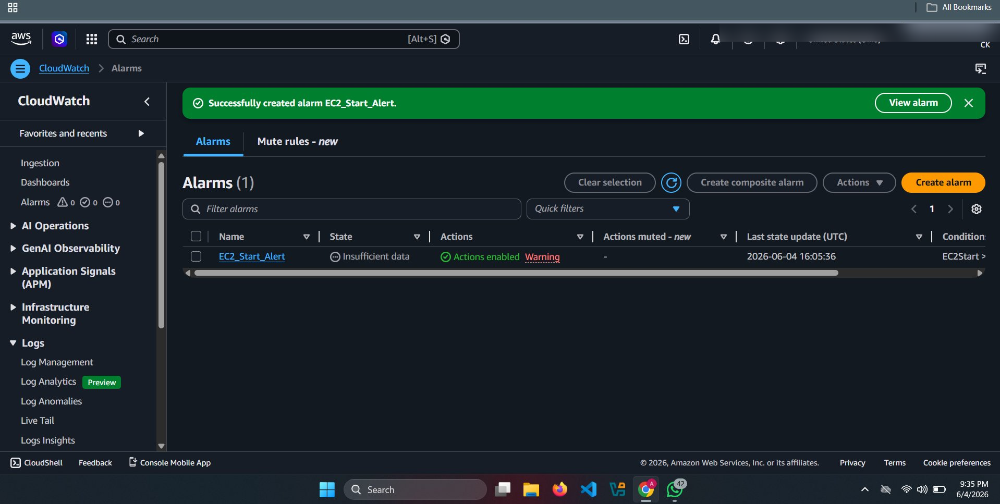
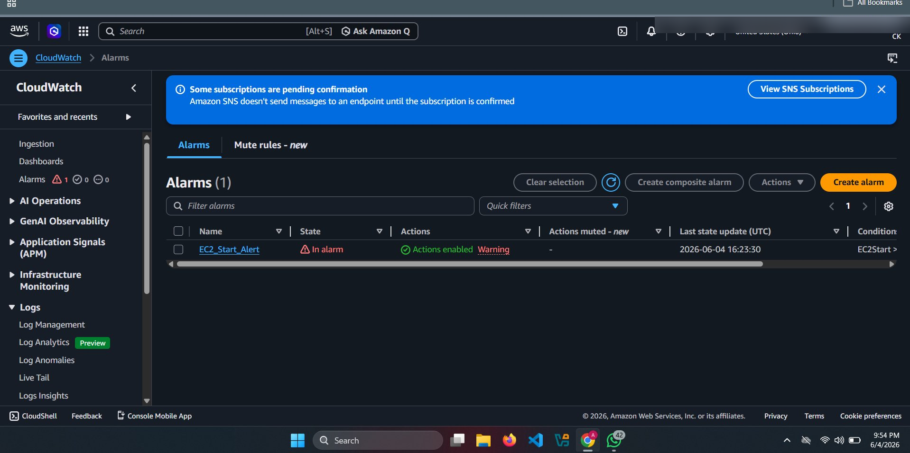

# 📊 CloudWatch Logs & Detection Setup

## 🎯 Objective
Integrate CloudTrail with CloudWatch Logs for real-time monitoring and alerting.

---

## 🧠 Why CloudWatch?

CloudWatch enables:
- Real-time log monitoring
- Metric-based detection
- Alert generation

---

## screenshots















## ⚙️ Step 1: Enable CloudTrail → CloudWatch Logs

1. Go to AWS Console → CloudTrail
2. Select your Trail
3. Click **Edit**
4. Enable:
   - ☑ Send to CloudWatch Logs
5. Create / Select Log Group:
   - `/aws/cloudtrail/logs`

---

## ⚙️ Step 2: Create Metric Filter

1. Go to CloudWatch → Log Groups
2. Select your CloudTrail log group
3. Click **Create Metric Filter**

### Example Filter (IAM User Creation)
```bash
{ $.eventName = "CreateUser" }

