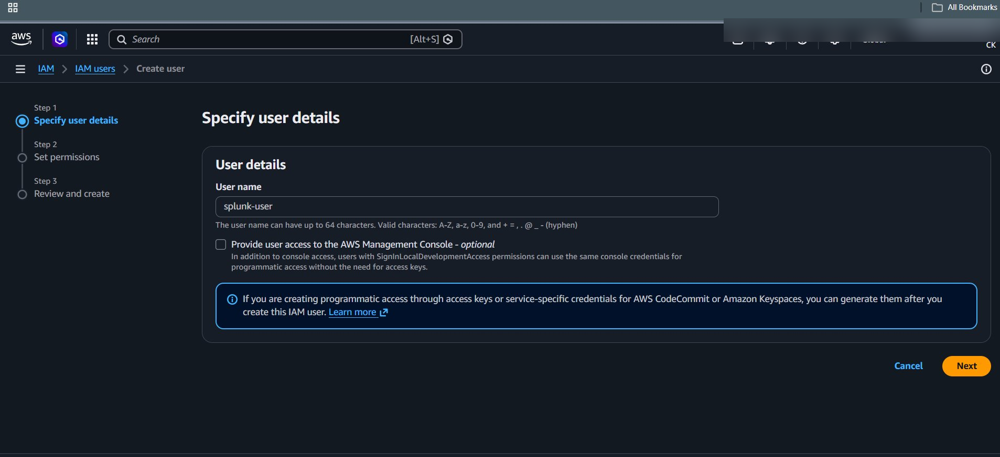

# 🔐 IAM Configuration

## 🎯 Objective

To configure AWS Identity and Access Management (IAM) for secure monitoring and logging of cloud activities.

---

## 🧠 Why IAM?

IAM is used to:

- Control access to AWS resources
- Assign permissions to users and services
- Enable CloudTrail logging
- Allow Splunk to ingest logs securely

---

## ⚙️ Configuration Steps

### Step 1: Create IAM User

1. Go to AWS Console → IAM
2. Click **Users → Create User**
3. Enter username:
   ```
   soc-monitor-user
   ```
4. Select:
   - ✅ Programmatic access

---

### Step 2: Assign Permissions

Attach the following policies:

- `AdministratorAccess` *(for lab purposes only)*

OR (recommended for real-world):

- `CloudTrailFullAccess`
- `AmazonS3ReadOnlyAccess`
- `AmazonSNSFullAccess`
- `AmazonSQSFullAccess`

---

### Step 3: Create Access Keys

1. After user creation
2. Download:
   - Access Key ID
   - Secret Access Key

⚠️ Save securely — used in Splunk

---

## 📸 Screenshots



---

## ✅ Validation

- IAM user created successfully
- Policies attached
- Access keys generated

---

## 🔐 Security Notes

- Avoid using `AdministratorAccess` in production
- Rotate access keys regularly
- Use MFA for IAM users

---

## 🔗 Next Step

Proceed to:

➡️ `CloudTrail_Setup.md`
