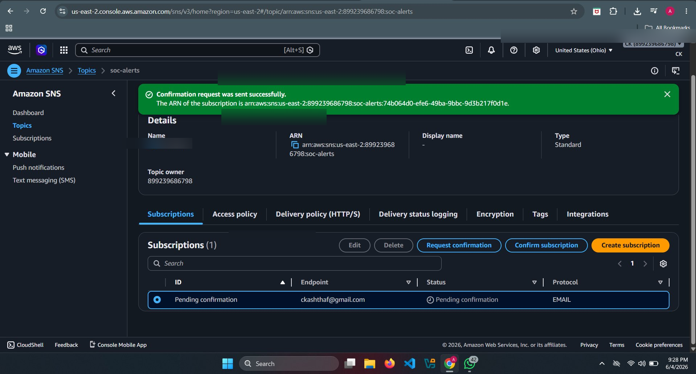

# 📢 SNS Topic Configuration

## 🎯 Objective

To configure Amazon SNS (Simple Notification Service) to receive S3 event notifications and forward them to SQS and alerting systems.

---

## 🧠 Why SNS?

SNS is used to:

- Receive notifications from S3 when new logs arrive
- Act as a **fan-out service**
- Send alerts to:
  - SQS (for Splunk ingestion)
  - Email (for SOC alerts)

---

## 🏗️ Architecture Role

```
S3 → SNS → SQS → Splunk
         ↘ Email Alerts
```

SNS acts as the **alert distribution layer**

---

## ⚙️ Configuration Steps

### Step 1: Create SNS Topic

1. Go to AWS Console → SNS
2. Click **Create topic**

- Type:
  - ✅ Standard
- Name:
  ```
  soc-alerts-topic
  ```

---

### Step 2: Create Subscription (Email Alert)

1. Open the created topic
2. Click **Create subscription**

- Protocol:
  - Email
- Endpoint:
  ```
  your-email@example.com
  ```

3. Confirm subscription from your email inbox

---

### Step 3: Create Subscription (SQS)

⚠️ SQS will be created in next step, but keep this ready

- Protocol:
  - Amazon SQS
- Endpoint:
  - (Select your queue later)

---

### Step 4: Connect S3 to SNS

Go back to S3:

1. Bucket → Properties → Event Notifications
2. Edit your existing event:

- Destination:
  - ✅ SNS Topic
- Select:
  ```
  soc-alerts-topic
  ```

---

## 📸 Screenshots




---

## 🔍 What Happens Here?

When CloudTrail logs are delivered to S3:

➡️ S3 triggers SNS  
➡️ SNS sends notification to:
   - 📩 Email (alert)
   - 📥 SQS (queue for Splunk)

---

## 🚨 SOC Use Case

SNS enables:

- Real-time alerting
- Notification of suspicious activity
- Integration with monitoring tools

---

## 🔐 Security Notes

- Restrict who can publish to SNS
- Avoid exposing topic publicly
- Monitor subscription endpoints

---

## ✅ Validation

1. Upload or trigger CloudTrail log
2. Check:
   - Email received
   - SNS metrics updated

---

## 🔗 Navigation

⬅️ Previous: [S3 Setup](./S3_Setup.md)

➡️ Next: [SQS Setup](./SQS_Setup.md)
