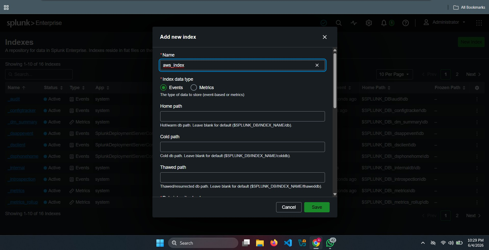
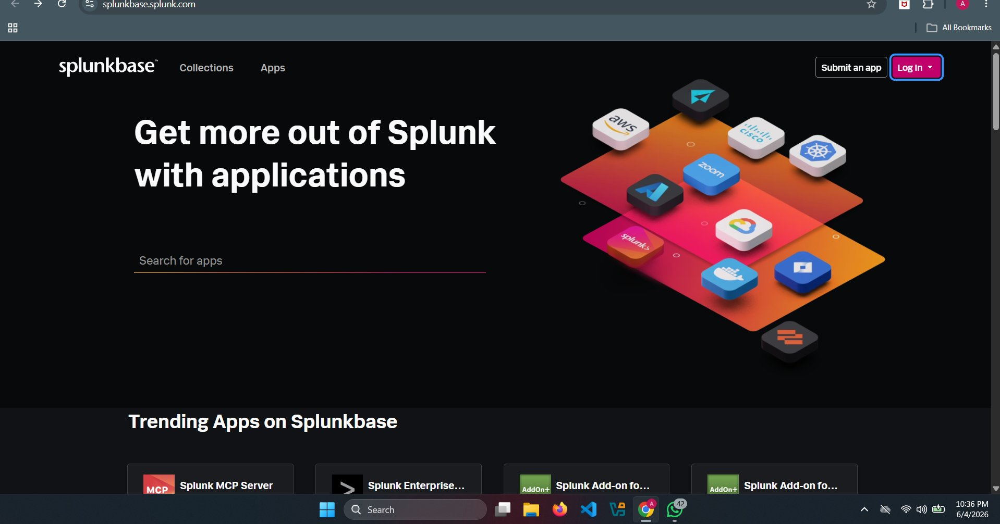
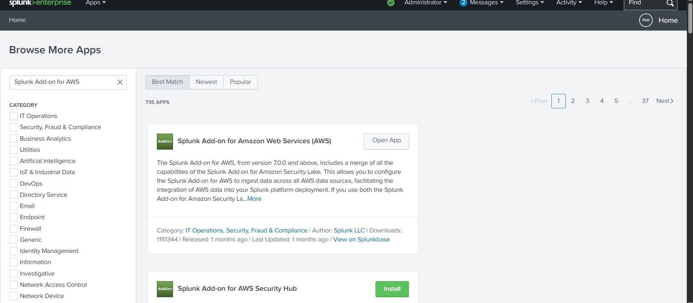
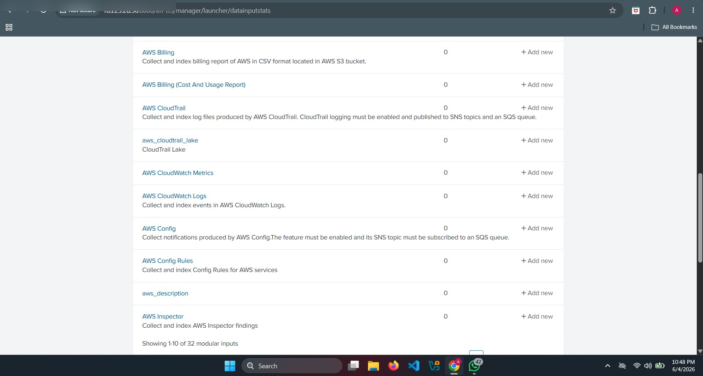
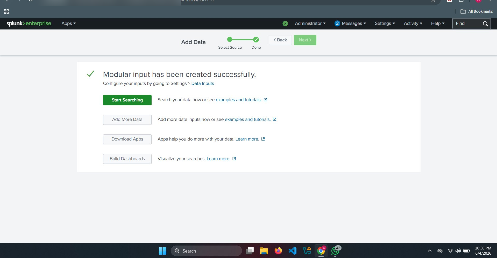
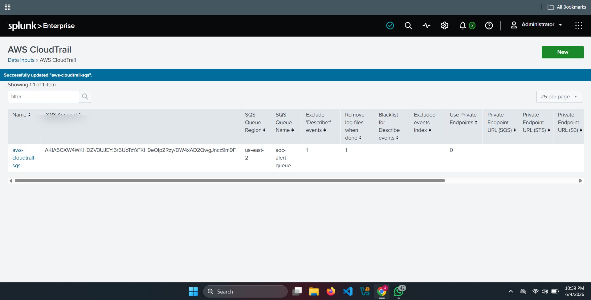
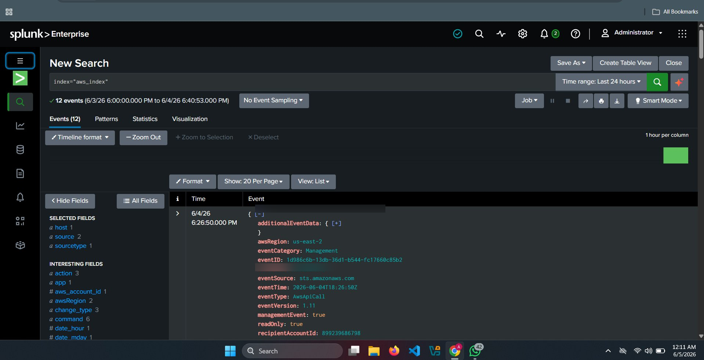

# 📊 Splunk Integration (AWS CloudTrail Logs)

## 🎯 Objective

To integrate AWS CloudTrail logs into Splunk using SQS and the Splunk Add-on for AWS.

---

## 🧠 Why Splunk?

Splunk is used as a SIEM (Security Information and Event Management) platform to:

- Collect logs from AWS
- Analyze security events
- Detect suspicious activity
- Generate alerts

---

## 🏗️ Architecture Role

```
CloudTrail → S3 → SNS → SQS → Splunk Add-on → Splunk Index
```

Splunk acts as the **central detection and monitoring system**

---

## ⚙️ Configuration Steps

### Step 1: Install Splunk Add-on for AWS

1. Open Splunk Web
2. Go to:
   ```
   Apps → Find More Apps
   ```
3. Search:
   ```
   Splunk Add-on for AWS
   ```
4. Install and restart Splunk

---

### Step 2: Create IAM User for Splunk

Create a dedicated IAM user:

- Name:
  ```
  splunk-user
  ```

Attach permissions:

- AmazonSQSFullAccess
- AmazonS3ReadOnlyAccess
- CloudTrailReadOnlyAccess

---

### Step 3: Generate Access Keys

1. Go to IAM → Users → splunk-user
2. Create:
   - Access Key ID
   - Secret Access Key

⚠️ Save securely

---

### Step 4: Configure AWS Account in Splunk

1. Go to:
   ```
   Splunk Add-on for AWS → Configuration → Accounts
   ```
2. Click **Add New**

Enter:

- Access Key
- Secret Key
- Account Name:
  ```
  aws-lab
  ```

---

### Step 5: Configure SQS Data Input

1. Go to:
   ```
   Splunk Add-on → Inputs → Create New Input
   ```

2. Select:
   - SQS-Based S3

3. Enter:

- SQS Queue Name:
  ```
  soc-alert-queue
  ```
- Region:
  ```
  your-region
  ```

---

### Step 6: Configure Index

Set index:

```
aws_index
```

---

## 📸 Screenshots















---

## 🔍 Validation

1. Go to Splunk Search:

```
index=aws_index
```

2. You should see:

- CloudTrail logs
- API activity events

---

## 🔎 Example Events

| Event | Description |
|------|-------------|
| CreateUser | IAM user created |
| StartInstances | EC2 started |
| AttachUserPolicy | Privilege escalation |

---

## 🚨 SOC Insight

Splunk enables:

- Detection engineering
- Threat hunting
- Alert generation
- Incident response

---

## 🔐 Security Best Practices

- Use least privilege IAM role
- Rotate keys regularly
- Monitor ingestion errors

---
## 🔗 Navigation

⬅️ Previous: [CloudWatch Setup](./CloudWatch_Setup.md)

➡️ Next: *Setup Completed ✅*
