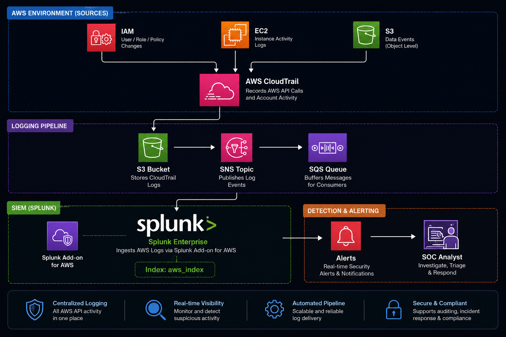

# ☁️ AWS Cloud Security Monitoring Lab (SOC Project)


## 📌 Overview

This project demonstrates a **real-world SOC (Security Operations Center) pipeline** built using AWS and Splunk.

It simulates cloud attacks, detects them using Splunk, and generates alerts based on AWS CloudTrail logs.

---

## 🏗️ Architecture



---

## ⚙️ Pipeline Flow

```
AWS → CloudTrail → S3 → SNS → SQS → Splunk → Detection → Alerts
```

---

## 🎯 Objectives

* Monitor AWS activity using CloudTrail
* Detect suspicious actions
* Build Splunk detection rules
* Simulate real-world attacks
* Map detections to MITRE ATT&CK

---

## ⚔️ Attack Scenarios

| Attack                                                                         | Description          |
| ------------------------------------------------------------------------------ | -------------------- |
| [IAM User Creation](Attack_Scenarios/IAM_User_Creation.md)                     | Persistence          |
| [Policy Modification](Attack_Scenarios/IAM_Policy_Modification.md)             | Privilege Escalation |
| [Access Key Creation](Attack_Scenarios/Access_Key_Creation.md)                 | Credential Abuse     |
| [S3 Public Access](Attack_Scenarios/S3_Public_Access.md)                       | Data Exposure        |
| [Security Group Modification](Attack_Scenarios/Security_Group_Modification.md) | Network Exposure     |

---

## 🚨 Detection Rules

| Detection                                                                            | Description                 |
| ------------------------------------------------------------------------------------ | --------------------------- |
| [IAM User Detection](Detection_Rules/IAM_User_Creation_Detection.md)                 | Detect user creation        |
| [Policy Detection](Detection_Rules/Policy_Modification_Detection.md)                 | Detect privilege escalation |
| [Access Key Detection](Detection_Rules/Access_Key_Creation_Detection.md)             | Detect credential creation  |
| [S3 Detection](Detection_Rules/S3_Public_Access_Detection.md)                        | Detect public buckets       |
| [Security Group Detection](Detection_Rules/Security_Group_Modification_Detection.md) | Detect open ports           |

---

## 🧱 Infrastructure Setup

* [IAM Setup](Infrastructure_Setup/IAM_Setup.md)
* [CloudTrail Setup](Infrastructure_Setup/CloudTrail_Setup.md)
* [S3 Setup](Infrastructure_Setup/S3_Setup.md)
* [SNS Setup](Infrastructure_Setup/SNS_Setup.md)
* [SQS Setup](Infrastructure_Setup/SQS_Setup.md)
* [Splunk Integration](Infrastructure_Setup/Splunk_Integration.md)

---

## 🧠 MITRE ATT&CK Mapping

[View MITRE Mapping](MITRE_ATTACK/MITRE_Mapping.md)

---

## 📸 Screenshots

All screenshots are stored in:

```
/assets
```

---

## 🚀 Key Learnings

* Cloud log ingestion pipeline
* Detection engineering using Splunk
* AWS attack simulation
* SOC alert creation
* Cloud security monitoring

---

## 👨‍💻 Author

Abdull Ashthaf CK
