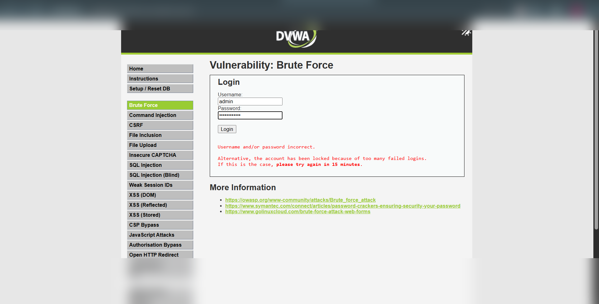
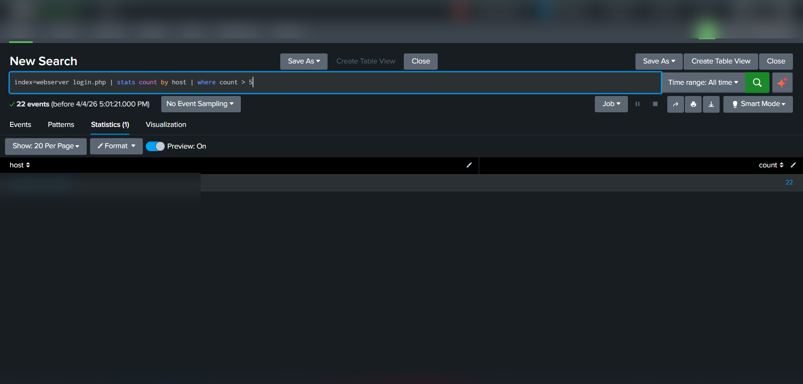
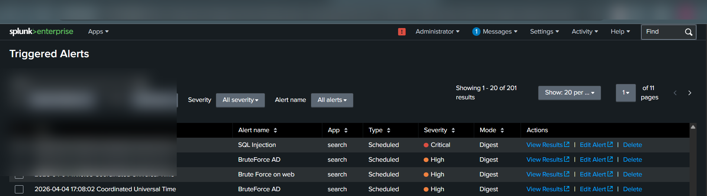

# Brute Force Attack (Web Login) – Detection & Analysis (DVWA Lab)


---

## 📌 Overview

A Brute Force attack involves repeatedly attempting different username/password combinations to gain unauthorized access to an application.

In this lab, multiple login attempts were performed on **DVWA login page** and detected using **Splunk SIEM**.

---

## 🧪 Lab Setup

* Target: DVWA Web Application
* Vulnerable Endpoint: `/DVWA/login.php`
* Log Source: Apache Web Server Logs
* SIEM Tool: Splunk Enterprise
* Attack Method: Manual repeated login attempts

---

## ⚔️ Attack Execution (Actual Steps Performed)

### Step 1: Access Login Page

Navigated to:

```bash id="n0y8pl"
/DVWA/login.php
```

---

### Step 2: Perform Multiple Login Attempts

* Tried multiple incorrect credentials
* Repeated login attempts triggered lockout message:

  * *“Account locked due to too many failed logins”*

---

### Step 3: Observed Behavior

* Multiple failed login attempts recorded
* Same endpoint accessed repeatedly
* High frequency requests from same source

---

## 📸 Evidence

### 🔹 Brute Force Activity


### 🔹 Brute Force spl


### 🔹 Brute Force triggered


* Multiple login requests sent to:

```bash id="1kjw0g"
/DVWA/login.php
```

---

### 🔹 Application Response

* Error message:

```text id="g6l3yx"
Username and/or password incorrect
```

* Lockout message:

```text id="y3p8rs"
Account locked due to too many failed logins
```

---

### 🔹 Splunk Log Pattern

* Repeated access to login endpoint
* High number of events from same host

---

## 🔍 Detection in Splunk (Your Actual Query)

```spl id="d8h3yo"
index=webserver login.php
| stats count by host
| where count > 5
```

---

### 🔹 Detection Logic

* Tracks number of login attempts per host
* Flags hosts exceeding threshold (>5 attempts)

---

## 🚨 Alert Creation (Performed)

* Alert Name: **Brute Force on web**
* Condition: `Number of results > 0`
* Trigger Type: Scheduled
* Severity: **High**

---

## 📊 Triggered Alert Evidence

* Alert successfully triggered in Splunk
* Host generated **22 login attempts**
* Identified as suspicious brute force behavior

---

## 🧠 MITRE ATT&CK Mapping

| Tactic            | Technique      | ID    |
| ----------------- | -------------- | ----- |
| Credential Access | Brute Force    | T1110 |
| Initial Access    | Valid Accounts | T1078 |

---

## 💥 Impact

* Unauthorized account access
* Account lockouts (DoS impact)
* Credential compromise
* Potential privilege escalation

---

## 🛡️ Mitigation

* Implement account lockout policies
* Use CAPTCHA / MFA
* Rate limiting login attempts
* Monitor failed login patterns
* Use strong password policies

---

## 📚 Conclusion

This lab demonstrated how repeated login attempts can be used to perform brute force attacks. Splunk detection using frequency-based queries helps identify such attacks effectively.

---

