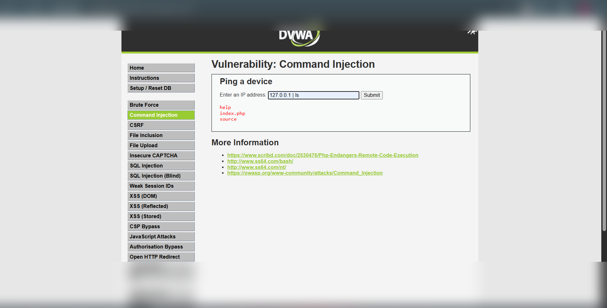
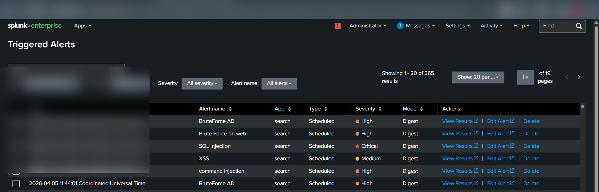
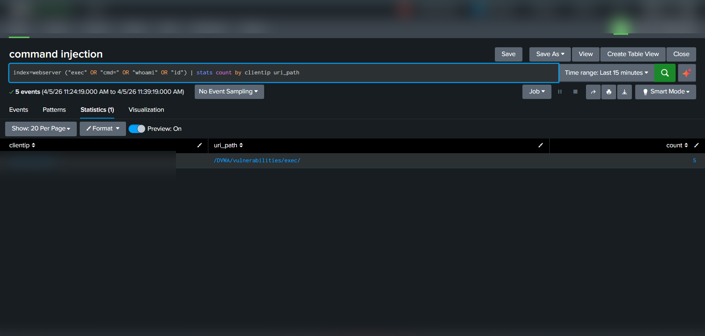

# Command Injection – Detection & Analysis (DVWA Lab)


---

## 📌 Overview

Command Injection is a web vulnerability that allows attackers to execute arbitrary system commands on a server by injecting malicious input into application parameters.

In this lab, the attack was performed on **DVWA (Damn Vulnerable Web Application)** and detected using **Splunk SIEM**.

---

## 🧪 Lab Setup

* Target: DVWA Web Application
* Vulnerable Endpoint: `/DVWA/vulnerabilities/exec/`
* Log Source: Apache Web Server Logs
* SIEM Tool: Splunk Enterprise
* Attack Machine: Kali Linux / Browser

---

## ⚔️ Attack Execution (Actual Steps Performed)

### Step 1: Access Command Injection Page

Navigated to:

```bash
/DVWA/vulnerabilities/exec/
```

---

### Step 2: Inject Malicious Input

Entered the following payload in **IP address field**:

```bash
127.0.0.1 | ls
```

---

### Step 3: Exploit Result

* Application executed system command (`ls`)
* Output displayed:

  * `help`
  * `index.php`
  * `source`
* Confirms command execution on server

---

## 📸 Evidence

### 🔹 Command Injection Execution


### 🔹 Command Injection triggered



* Input used:

```bash
127.0.0.1 | ls
```

* Output shows directory listing → proves command execution

---

### 🔹 Splunk Detection Logs


Detected suspicious keywords in logs:

* `cmd=`
* `exec`
* `whoami`
* `id`

Example request pattern:

```bash
/DVWA/vulnerabilities/exec/?ip=127.0.0.1|ls
```

---

## 🔍 Detection in Splunk (Your Actual Query)

```spl
index=webserver ("exec" OR "cmd=" OR "whoami" OR "id")
| stats count by clientip uri_path
```

---

## 🚨 Alert Creation (Performed)

* Alert Name: **command injection**
* Condition: `Number of results > 0`
* Trigger Type: Scheduled
* Severity: **High**

---

## 📊 Triggered Alert Evidence

* Alert successfully triggered in Splunk
* Suspicious requests detected from attacker IP
* Endpoint `/exec/` flagged with command patterns

---

## 🧠 MITRE ATT&CK Mapping

| Tactic         | Technique                         | ID    |
| -------------- | --------------------------------- | ----- |
| Initial Access | Exploit Public-Facing Application | T1190 |
| Execution      | Command and Scripting Interpreter | T1059 |
| Discovery      | System Information Discovery      | T1082 |

---

## 💥 Impact

* Remote command execution (RCE)
* Full server compromise
* Data exfiltration
* Privilege escalation possibilities

---

## 🛡️ Mitigation

* Avoid direct system command execution
* Use safe APIs instead of shell commands
* Input validation & sanitization
* Disable dangerous functions (`exec`, `system`)
* Use least privilege for application user

---

## 📚 Conclusion

This lab demonstrated how improper input validation can lead to command execution on a server. Splunk detection using keyword-based queries helps identify such attacks effectively in web logs.

---

