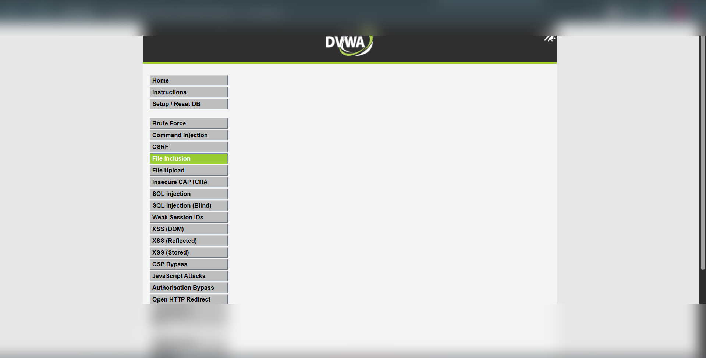
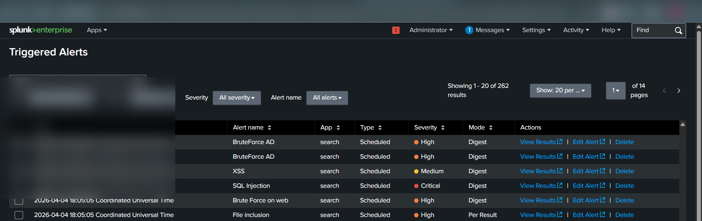
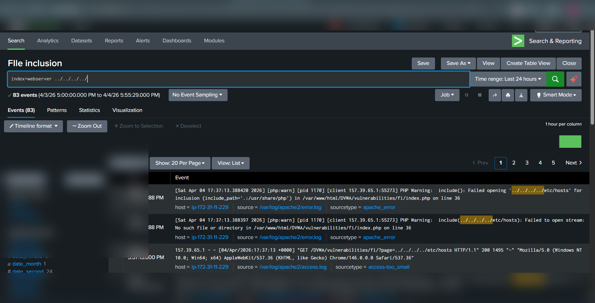

# File Inclusion (LFI) – Detection & Analysis (DVWA Lab)

---

## 📌 Overview

Local File Inclusion (LFI) is a vulnerability that allows attackers to include and read files from the server by manipulating file path parameters.

In this lab, the attack was performed on **DVWA (Damn Vulnerable Web Application)** and detected using **Splunk SIEM**.

---

## 🧪 Lab Setup

* Target: DVWA Web Application
* Vulnerable Endpoint: `/DVWA/vulnerabilities/fi/`
* Log Source: Apache Web Server Logs (`access.log`, `error.log`)
* SIEM Tool: Splunk Enterprise
* Attack Machine: Kali Linux / Browser

---

## ⚔️ Attack Execution (Actual Steps Performed)

### Step 1: Access File Inclusion Page

Navigated to:

```bash
/DVWA/vulnerabilities/fi/
```

---

### Step 2: Inject Directory Traversal Payload

Entered the following payload in URL parameter:

```bash
?page=../../../../etc/hosts
```

---

### Step 3: Exploit Result

* Application attempted to include system file
* `/etc/hosts` accessed via traversal
* Server returned file content OR error (depending on config)

---

## 📸 Evidence

### 🔹 File Inclusion Payload


### 🔹 File Inclusion Payload


```bash
../../../../etc/hosts
```
---

### 🔹 Splunk Log Evidence


From **access logs**:

```bash
GET /DVWA/vulnerabilities/fi/?page=../../../../etc/hosts
```

From **error logs**:

```bash
include(): Failed opening '../../../../etc/hosts'
```

---

## 🔍 Detection in Splunk (Your Actual Query)

```spl
index=webserver ../../../../
```

---

### 🔹 Improved Detection Query

```spl
index=webserver ("../" OR "../../" OR "../../../../" OR "etc/passwd" OR "etc/hosts")
```

---

## 🚨 Alert Creation (Performed)

* Alert Name: **File inclusion**
* Condition: `Number of results > 0`
* Trigger Type: Scheduled
* Severity: **High**

---

## 📊 Triggered Alert Evidence

* Alert triggered successfully in Splunk
* Multiple events detected
* Logs show traversal attempts and PHP warnings

---

## 🧠 MITRE ATT&CK Mapping

| Tactic         | Technique                         | ID    |
| -------------- | --------------------------------- | ----- |
| Initial Access | Exploit Public-Facing Application | T1190 |
| Discovery      | File and Directory Discovery      | T1083 |
| Collection     | Data from Local System            | T1005 |

---

## 💥 Impact

* Access to sensitive system files
* Information disclosure
* Credential leakage (e.g., `/etc/passwd`)
* Potential Remote Code Execution (if chained)

---

## 🛡️ Mitigation

* Validate and sanitize file paths
* Use allowlists for file inclusion
* Disable dynamic file inclusion
* Restrict file system permissions
* Implement WAF rules

---

## 📚 Conclusion

This lab demonstrated how directory traversal can be used to perform Local File Inclusion. Splunk detection using pattern-based searches on traversal sequences helps identify such attacks effectively.

---

