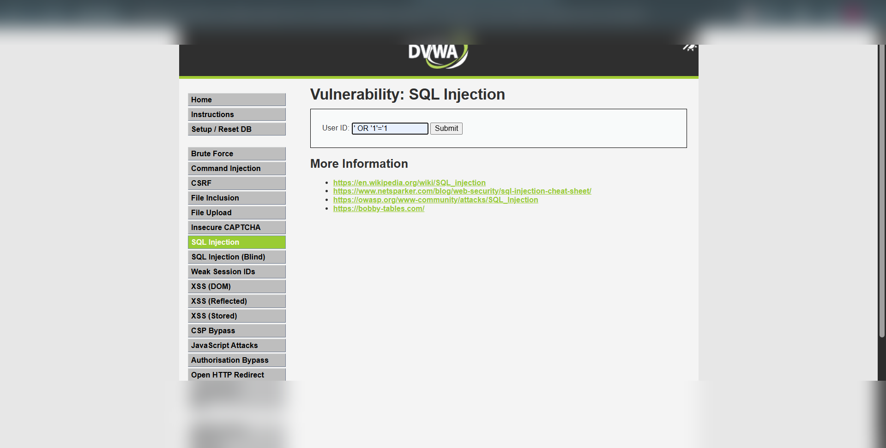
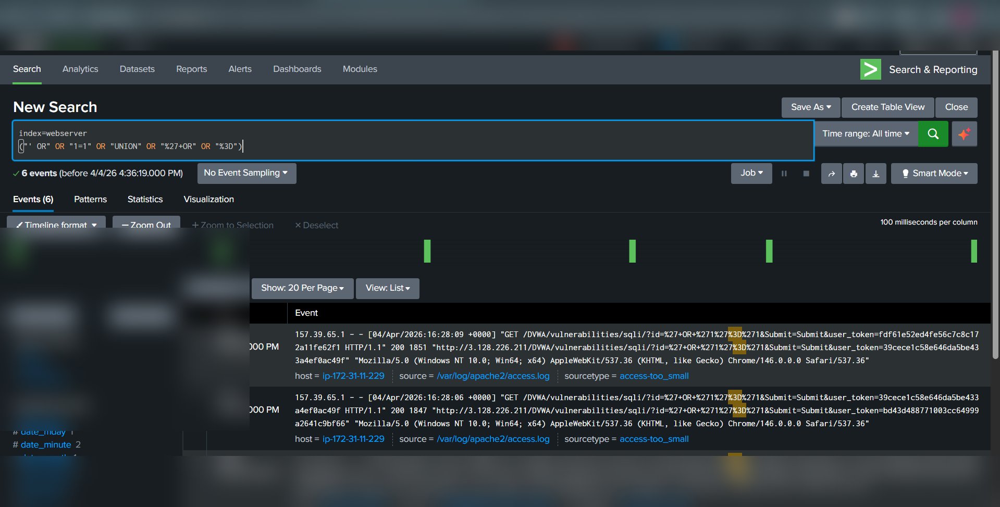
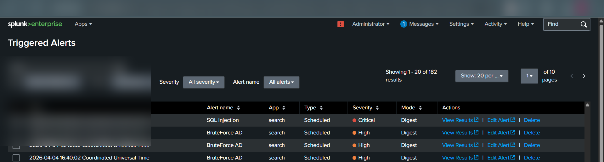

# SQL Injection (SQLi) – Detection & Analysis (DVWA Lab)

---

## 📌 Overview

SQL Injection is a web vulnerability that allows attackers to manipulate backend database queries by injecting malicious SQL payloads through user input fields.

In this lab, the attack was performed on **DVWA (Damn Vulnerable Web Application)** and detected using **Splunk SIEM**.

---

## 🧪 Lab Setup

* Target: DVWA Web Application
* Vulnerable Endpoint: `/DVWA/vulnerabilities/sqli/`
* Log Source: Apache Web Server Logs
* SIEM Tool: Splunk Enterprise
* Attack Machine: Kali Linux / Browser

---

## ⚔️ Attack Execution (Actual Steps Performed)

### Step 1: Access SQL Injection Page

Navigated to:

```
/DVWA/vulnerabilities/sqli/
```

---

### Step 2: Inject Payload

Entered the following payload in **User ID field**:

```sql
' OR '1'='1
```

---

### Step 3: Exploit Result

* Application returned all records from database
* Authentication logic bypassed
* SQL query manipulated successfully

---

## 📸 Evidence

### 🔹 SQL Injection Execution


🔹 SQL Injection spl


🔹 SQL Injection triggered


* Payload visible in URL:

```
id=%27+OR+%271%27%3D%271
```

---

### 🔹 Splunk Detection Logs

Detected encoded payloads:

* `%27` → `'`
* `%3D` → `=`
* `OR` condition usage

Example log:

```
GET /DVWA/vulnerabilities/sqli/?id=%27+OR+%271%27%3D%271
```

---

## 🔍 Detection in Splunk (Your Actual Queries)

### Detection Query 1 (Encoded Payload Detection)

```spl
index=webserver ("%27+OR" OR "%27" OR "%3D" OR "UNION")
```

---

### Detection Query 2 (Generic SQLi Pattern)

```spl
index=webserver ("' OR" OR "1=1" OR "UNION")
```

---

### Detection Query 3 (Refined Detection)

```spl
index=webserver ("' OR" OR "1=1" OR "UNION" OR "%27+OR" OR "%3D")
```

---

## 🚨 Alert Creation (Performed)

* Alert Name: **SQL Injection**
* Condition: `Number of results > 0`
* Trigger Type: Scheduled / Real-time
* Severity: **Critical**

---

## 📊 Triggered Alert Evidence

* Alert successfully triggered in Splunk
* Multiple events detected from same IP
* Payloads identified in web logs

---

## 🧠 MITRE ATT&CK Mapping

| Tactic            | Technique                         | ID    |
| ----------------- | --------------------------------- | ----- |
| Initial Access    | Exploit Public-Facing Application | T1190 |
| Credential Access | Credentials from Web Apps         | T1555 |
| Discovery         | Query Database                    | T1012 |

---

## 💥 Impact

* Authentication bypass
* Unauthorized database access
* Exposure of sensitive data
* Potential full database compromise

---

## 🛡️ Mitigation

* Use parameterized queries (Prepared Statements)
* Input validation & sanitization
* Deploy Web Application Firewall (WAF)
* Restrict database privileges

---

## 📚 Conclusion

This lab demonstrated how SQL Injection can be exploited using simple payloads and how SIEM tools like Splunk can detect such attacks using log analysis and pattern matching.

---
