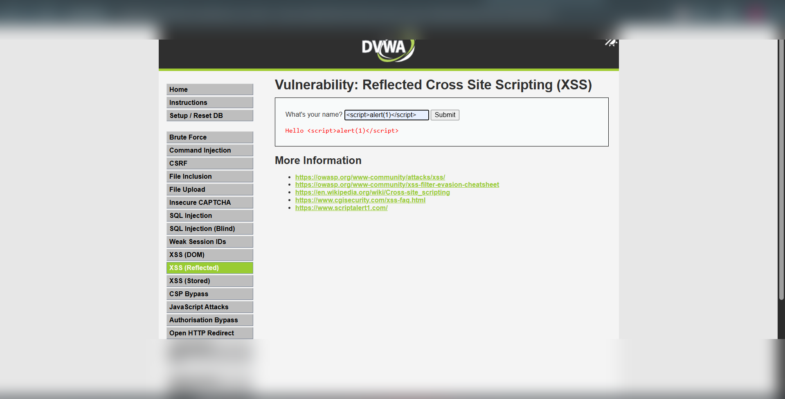
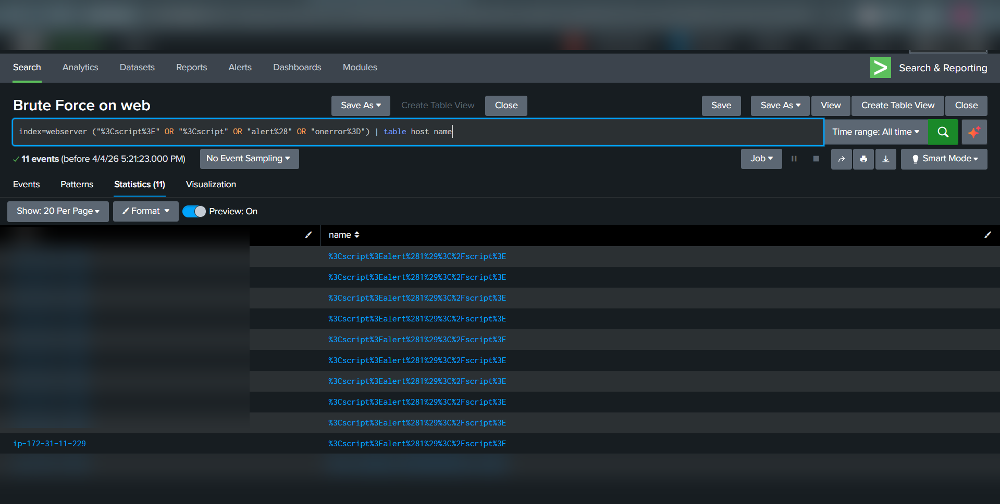
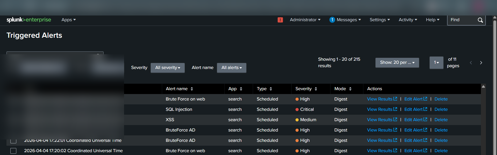

# Cross-Site Scripting (XSS – Reflected) – Detection & Analysis (DVWA Lab)


---

## 📌 Overview

Cross-Site Scripting (XSS) is a web vulnerability that allows attackers to inject malicious JavaScript into web applications, which executes in the victim’s browser.

In this lab, a **Reflected XSS** attack was performed on **DVWA** and detected using **Splunk SIEM**.

---

## 🧪 Lab Setup

* Target: DVWA Web Application
* Vulnerable Endpoint: `/DVWA/vulnerabilities/xss_r/`
* Log Source: Apache Web Server Logs
* SIEM Tool: Splunk Enterprise
* Attack Machine: Kali Linux / Browser

---

## ⚔️ Attack Execution (Actual Steps Performed)

### Step 1: Access XSS Page

Navigated to:

```bash id="e9u4c2"
/DVWA/vulnerabilities/xss_r/
```

---

### Step 2: Inject Malicious Script

Entered the following payload in input field:

```html id="0a4ypl"
<script>alert(1)</script>
```

---

### Step 3: Exploit Result

* Application reflected input without sanitization
* Browser executed injected JavaScript
* Popup alert displayed → confirms XSS vulnerability

---

## 📸 Evidence

### 🔹 XSS Payload


### 🔹 XSS spl


### 🔹 XSS triggered


```html id="m8m1r4"
<script>alert(1)</script>
```

---

### 🔹 Encoded Payload in Logs

```text id="j6s7pg"
%3Cscript%3Ealert%281%29%3C/script%3E
```

---

### 🔹 Example Request

```bash id="7f4hsv"
GET /DVWA/vulnerabilities/xss_r/?name=<script>alert(1)</script>
```

---

## 🔍 Detection in Splunk (Your Actual Query)

```spl id="1mb3tm"
index=webserver ("%3Cscript%3E" OR "%3C/script%3E" OR "alert%28" OR "onerror%3D")
| table host name
```

---

### 🔹 Detection Logic

* `%3Cscript%3E` → `<script>`
* `%3C/script%3E` → `</script>`
* `alert%28` → `alert(`
* `onerror=` → alternative XSS payload

---

## 🚨 Alert Creation (Performed)

* Alert Name: **XSS**
* Condition: `Number of results > 0`
* Trigger Type: Scheduled
* Severity: **Medium**

---

## 📊 Triggered Alert Evidence

* Alert successfully triggered in Splunk
* Multiple encoded XSS payloads detected
* Same host generating repeated requests

---

## 🧠 MITRE ATT&CK Mapping

| Tactic            | Technique                         | ID    |
| ----------------- | --------------------------------- | ----- |
| Initial Access    | Exploit Public-Facing Application | T1190 |
| Execution         | Command and Scripting Interpreter | T1059 |
| Credential Access | Input Capture                     | T1056 |

---

## 💥 Impact

* Session hijacking
* Credential theft
* Malicious script execution in victim browser
* Defacement or phishing

---

## 🛡️ Mitigation

* Output encoding (HTML encoding)
* Input validation & sanitization
* Use Content Security Policy (CSP)
* Escape user input before rendering

---

## 📚 Conclusion

This lab demonstrated how reflected input can execute malicious scripts in a user's browser. Splunk detection using encoded payload patterns effectively identifies XSS attempts in web logs.

---

