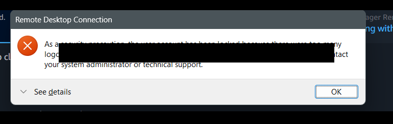
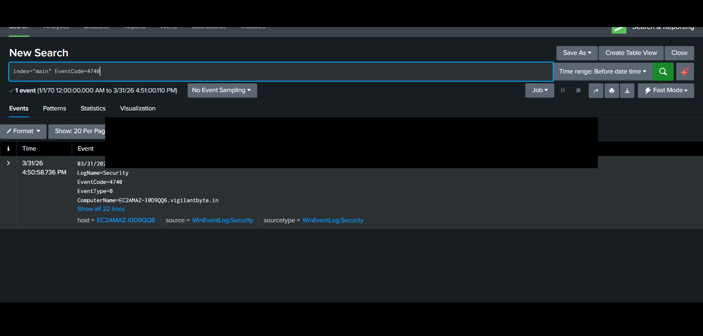

# 🟠 AD-02 — Account Lockout Detection (Event ID 4740)

---

## 📌 Objective

Detect account lockout events caused by multiple failed login attempts, indicating potential brute force or password guessing attacks.

---

## 🧠 Attack Description

Account lockout occurs when a user exceeds the allowed number of failed login attempts defined in the domain policy.

This is typically a defensive mechanism triggered after a brute force attack.

---

## ⚙️ Lab Environment

| Component     | Description                                         |
| ------------- | --------------------------------------------------- |
| Target System | Windows Server (Active Directory Domain Controller) |
| SIEM          | Splunk Enterprise                                   |
| Log Source    | Windows Security Logs                               |
| Forwarding    | Splunk Universal Forwarder                          |

---

## ⚔️ Attack Simulation Steps

1. Perform multiple failed login attempts on a user account
2. Exceed account lockout threshold (e.g., 5 attempts)
3. Account becomes locked
4. Observe lockout behavior

---

## 📜 Log Analysis

### 🔹 Event ID 4740 — Account Locked Out

This event is generated when a user account is locked.

### Important Fields:

* **Target_Account_Name** → Locked account
* **Caller_Computer_Name** → Source of lockout
* **Security_ID** → User SID

---

## 🔍 Splunk Detection Query

```spl
index="main" EventCode=4740
```

---

## 📊 Detection Logic

* Monitor account lockout events
* Identify which user account was locked
* Track source machine causing lockout
* Correlate with previous failed login attempts (Event ID 4625)

---

## 🔗 Correlation (IMPORTANT)

Account lockout is not standalone.

👉 It is usually preceded by:

* Event ID 4625 (Failed Logins)

SOC analysts correlate:

* Multiple 4625 events → followed by 4740

---

## 🚨 Alert Configuration

| Parameter | Value             |
| --------- | ----------------- |
| Condition | Any lockout event |
| Severity  | Medium            |
| Trigger   | Real-time         |

---

## 🧠 MITRE ATT&CK Mapping

| Category     | Details           |
| ------------ | ----------------- |
| Tactic       | Credential Access |
| Technique    | Password Guessing |
| Technique ID | T1110             |

---

## 🖼️ Screenshots

### 🔹 Account Lockout Event



### 🔹 Splunk Detection Output



### 🔹 Splunk Triggered

---

## 📚 Analysis

* Account lockout observed after repeated failures
* Indicates brute force or incorrect credential usage
* Helps identify attack attempts early

---

## 🛡️ Mitigation Strategies

* Configure appropriate lockout thresholds
* Monitor repeated lockouts
* Enable alerting for suspicious activity
* Investigate source system causing lockout

---

## 🧹 Cleanup Actions

* Unlock affected account
* Reset user password
* Verify no unauthorized access
* Review logs for anomalies

---

## 🔐 Notes

Sensitive information such as:

* IP addresses
* Domain names
* Usernames

has been sanitized before publishing.
