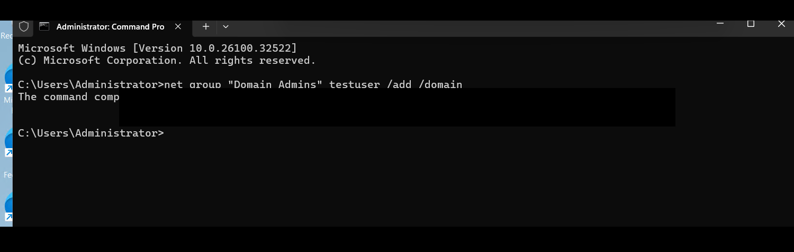
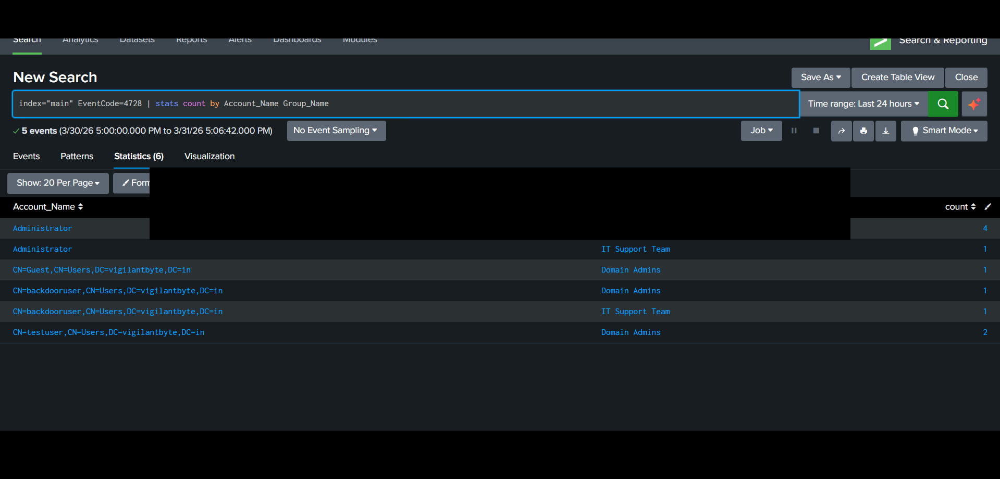
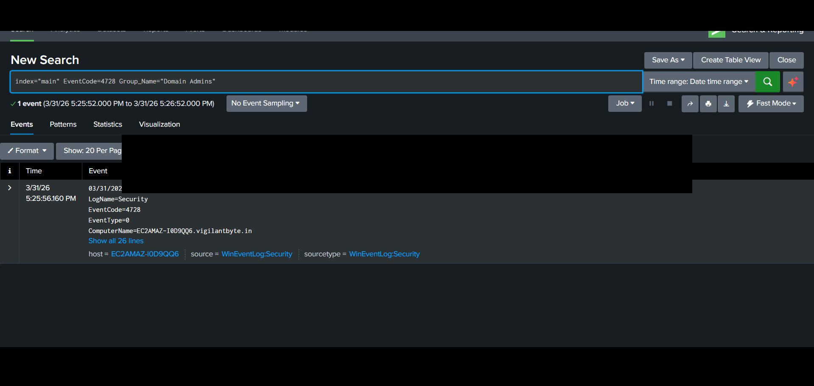

# 🔴 AD-03 — Privilege Escalation via Domain Admin Group (Event ID 4728)

---

## 📌 Objective

Detect unauthorized privilege escalation by monitoring when users are added to highly privileged groups such as Domain Admins.

---

## 🧠 Attack Description

Privilege escalation occurs when a user gains higher permissions than intended.

In Active Directory environments, attackers often add compromised accounts to privileged groups like **Domain Admins** to gain full control over the domain.

---

## ⚙️ Lab Environment

| Component     | Description                                         |
| ------------- | --------------------------------------------------- |
| Target System | Windows Server (Active Directory Domain Controller) |
| SIEM          | Splunk Enterprise                                   |
| Log Source    | Windows Security Logs                               |
| Forwarding    | Splunk Universal Forwarder                          |

---

## ⚔️ Attack Simulation Steps

1. Create or use an existing user account
2. Add the user to the **Domain Admins** group
3. Verify elevated privileges
4. Observe generated logs in Splunk

---

## 📜 Log Analysis

### 🔹 Event ID 4728 — Member Added to Security-Enabled Global Group

This event is generated when a user is added to a privileged group.

### Important Fields:

* **Member_Name** → User added
* **Group_Name** → Target group (Domain Admins)
* **Subject_Account_Name** → User who performed action

---

## 🔍 Splunk Detection Query

```spl
index="main" EventCode=4728
```

---

## 🎯 Focused Detection (HIGH VALUE)

```spl
index="main" EventCode=4728 Group_Name="Domain Admins"
```

---

## 📊 Detection Logic

* Monitor group membership changes
* Filter for high-privilege groups (Domain Admins)
* Identify:

  * Who added the user
  * Which user was added
* Detect unauthorized privilege escalation

---

## 🚨 Alert Configuration

| Parameter | Value                       |
| --------- | --------------------------- |
| Condition | User added to Domain Admins |
| Severity  | Critical                    |
| Trigger   | Real-time                   |

---

## 🧠 MITRE ATT&CK Mapping

| Category     | Details              |
| ------------ | -------------------- |
| Tactic       | Privilege Escalation |
| Technique    | Account Manipulation |
| Technique ID | T1098                |

---

## 🖼️ Screenshots

### 🔹 Privilege Escalation Event



### 🔹 Detection Output



### 🔹 Domain Abuse SPL


---

## 📚 Analysis

* A user was added to Domain Admins group
* This grants full administrative control
* High-risk action requiring immediate investigation

---

## 🛡️ Mitigation Strategies

* Restrict access to Domain Admin group
* Enable auditing of group membership changes
* Implement least privilege principle
* Monitor privileged actions continuously

---

## 🧹 Cleanup Actions

* Remove unauthorized user from Domain Admins
* Review group membership
* Reset affected accounts
* Audit logs for further compromise

---

## 🔐 Notes

Sensitive data such as:

* Usernames
* Domain names
* System details

has been sanitized before publishing.
