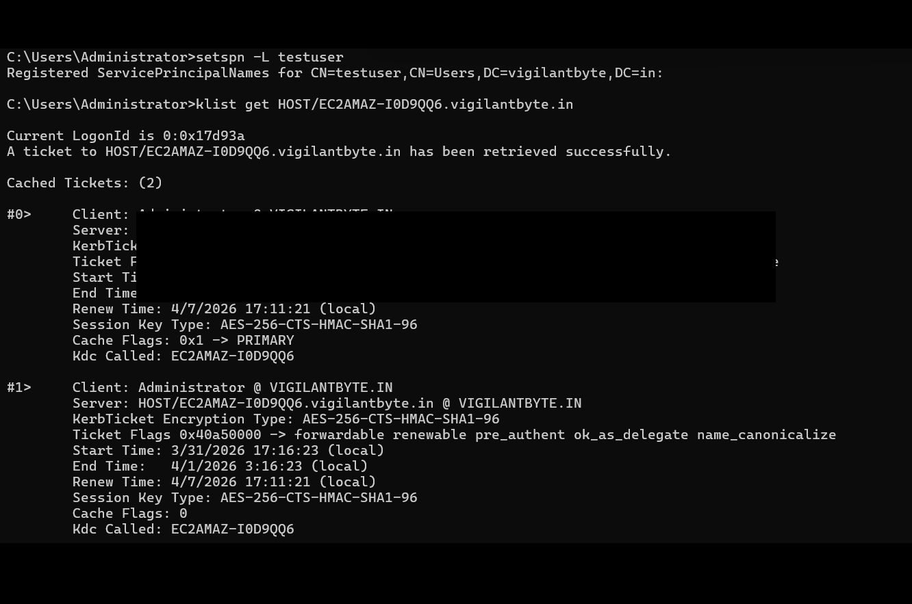
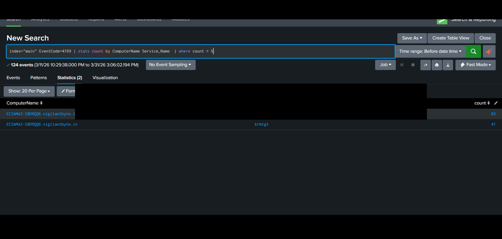

# 🟣 AD-04 — Kerberoasting Attack Detection (Event ID 4769)

---

## 📌 Objective

Detect Kerberoasting attacks by identifying abnormal Kerberos service ticket requests in Active Directory.

---

## 🧠 Attack Description

Kerberoasting is a credential access attack where an attacker requests Kerberos service tickets (TGS) for service accounts and extracts their hashes for offline password cracking.

Attackers target accounts with Service Principal Names (SPNs).

---

## ⚙️ Lab Environment

| Component        | Description                                         |
| ---------------- | --------------------------------------------------- |
| Target System    | Windows Server (Active Directory Domain Controller) |
| Attacker Machine | Manual Attack in AD itself                          |
| SIEM             | Splunk Enterprise                                   |
| Log Source       | Windows Security Logs                               |

---

## ⚔️ Attack Simulation Steps

1. Identify accounts with SPNs
2. Request service tickets using tools (e.g., Impacket, Rubeus)
3. Extract Kerberos tickets
4. Attempt offline password cracking

---

## 📜 Log Analysis

### 🔹 Event ID 4769 — Kerberos Service Ticket Requested

This event is generated when a Kerberos service ticket (TGS) is requested.

---

### Important Fields:

* **Account_Name** → Requesting user
* **Service_Name** → Target service
* **Ticket_Encryption_Type** → Encryption used
* **Client_Address** → Source IP

---

## 🔍 Splunk Detection Query

```spl
index="main" EventCode=4769
```

---

## 🎯 Advanced Detection (IMPORTANT)

```spl
index="main" EventCode=4769 
| stats count by Account_Name, Service_Name
```

---

## 🚨 Suspicious Indicators

* High number of ticket requests
* Requests for multiple services
* Unusual service accounts targeted
* Repeated requests in short time

---

## 📊 Detection Logic

* Monitor Kerberos ticket requests
* Identify abnormal frequency
* Detect unusual service access patterns
* Flag excessive requests from single user

---

## 🚨 Alert Configuration

| Parameter | Value                       |
| --------- | --------------------------- |
| Condition | High number of TGS requests |
| Severity  | Critical                    |
| Trigger   | Real-time                   |

---

## 🧠 MITRE ATT&CK Mapping

| Category     | Details           |
| ------------ | ----------------- |
| Tactic       | Credential Access |
| Technique    | Kerberoasting     |
| Technique ID | T1558.003         |

---

## 🖼️ Screenshots

### 🔹 Kerberos Ticket Requests



### 🔹 Detection Output



### 🔹 Kerberos Triggered


---

## 📚 Analysis

* Multiple service ticket requests observed
* Pattern suggests enumeration of service accounts
* Possible Kerberoasting attempt detected

---

## 🛡️ Mitigation Strategies

* Use strong passwords for service accounts
* Rotate service account credentials regularly
* Use managed service accounts (gMSA)
* Monitor Kerberos activity continuously

---

## 🧹 Cleanup Actions

* Review service accounts
* Reset credentials if compromised
* Monitor for further suspicious activity
* Clear tickets if needed

---

## 🔐 Notes

Sensitive data such as:

* Domain names
* Usernames
* Service names

has been sanitized before publishing.
