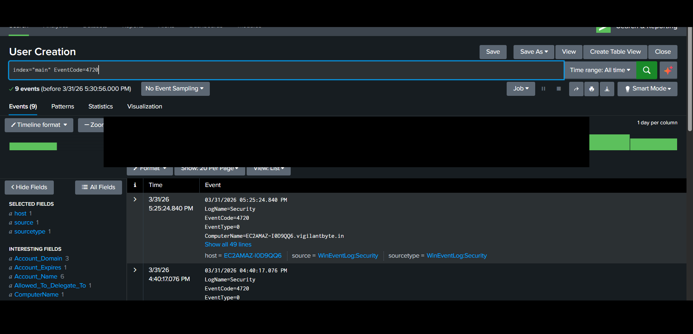
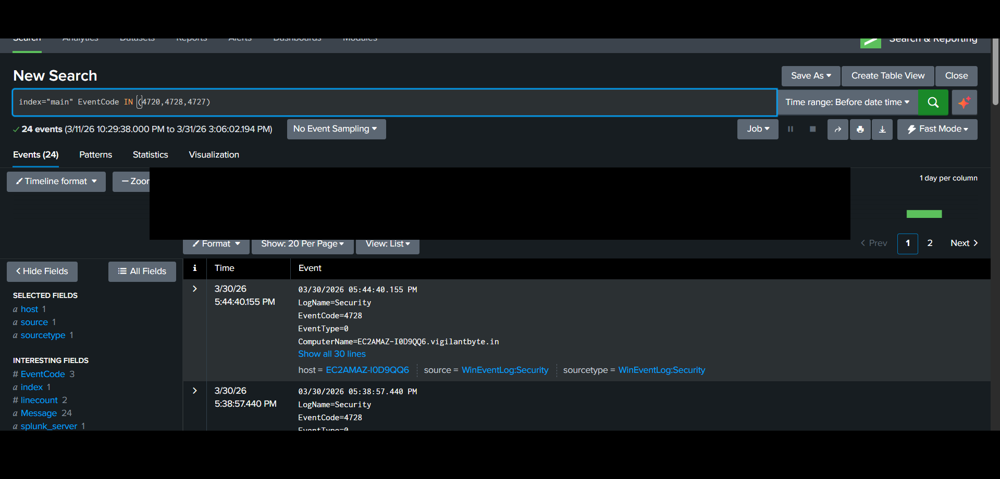
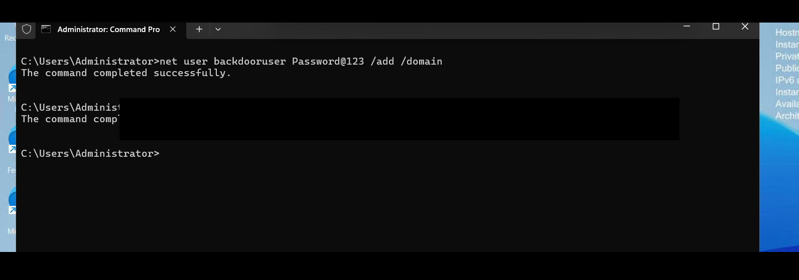
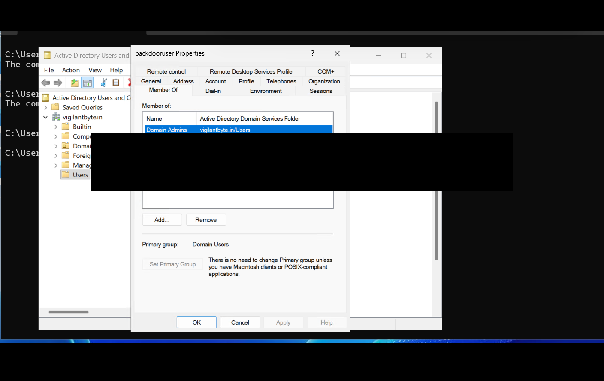

# 🔵 AD-05 — User & Privileged Group Creation (Event ID 4720 + 4728)

---

## 📌 Objective

Detect unauthorized user creation and privilege escalation by adding users to high-privilege groups like Domain Admins.

---

## 🧠 Attack Description

Attackers create new accounts and elevate privileges by adding them to administrative groups.

This ensures persistence and full control over the domain.

---

## ⚙️ Lab Environment

| Component     | Description                        |
| ------------- | ---------------------------------- |
| Target System | Windows Server (Domain Controller) |
| SIEM          | Splunk Enterprise                  |
| Log Source    | Windows Security Logs              |

---

## ⚔️ Attack Simulation Steps

1. Create a backdoor user:

```powershell
net user backdooruser Password@123 /add /domain
```

2. Add user to Domain Admins:

```powershell
net group "Domain Admins" backdooruser /add /domain
```

3. Verify in Active Directory Users and Computers (ADUC)

---

## 📜 Log Analysis

### 🔹 Event ID 4720 — User Created

* Triggered when new user is created

### 🔹 Event ID 4728 — Added to Security Group

* Triggered when user is added to privileged group

---

## 🔍 Splunk Detection Queries

### Detect User Creation:

```spl
index="main" EventCode=4720
```

### Detect Privilege Escalation:

```spl
index="main" EventCode=4728 Group_Name="Domain Admins"
```

---

## 📊 Detection Logic

* Identify newly created users
* Detect addition to Domain Admins
* Correlate both events
* Flag as high-risk activity

---

## 🚨 Alert Configuration

| Parameter | Value                       |
| --------- | --------------------------- |
| Condition | User added to Domain Admins |
| Severity  | Critical                    |
| Trigger   | Real-time                   |

---

## 🧠 MITRE ATT&CK Mapping

| Category     | Details                            |
| ------------ | ---------------------------------- |
| Tactic       | Persistence / Privilege Escalation |
| Technique    | Create Account                     |
| Technique ID | T1136                              |

---

## 🖼️ Screenshots

### 🔹 User Creation in Splunk



### 🔹 Privilege Escalation Detection (4728)



### 🔹 Command Execution Proof



### 🔹 ADUC Verification



---

## 📚 Analysis

* New user account created
* Immediately added to Domain Admins
* Indicates persistence + privilege escalation
* Highly suspicious activity

---

## 🛡️ Mitigation Strategies

* Restrict who can create users
* Monitor group membership changes
* Enable alerts for Domain Admin modifications
* Implement least privilege

---

## 🧹 Cleanup Actions

Remove malicious user:

```powershell
net user backdooruser /delete /domain
```

Remove from admin group:

```powershell
net group "Domain Admins" backdooruser /delete /domain
```

---

## 🔐 Notes

All sensitive information such as:

* Hostnames
* Domain names
* IP addresses

has been sanitized before publishing.
