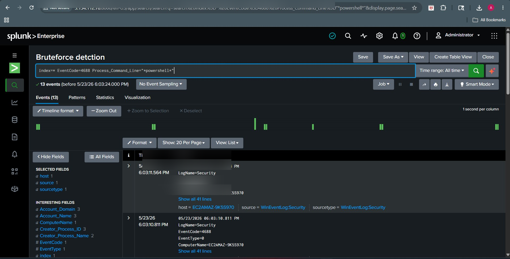
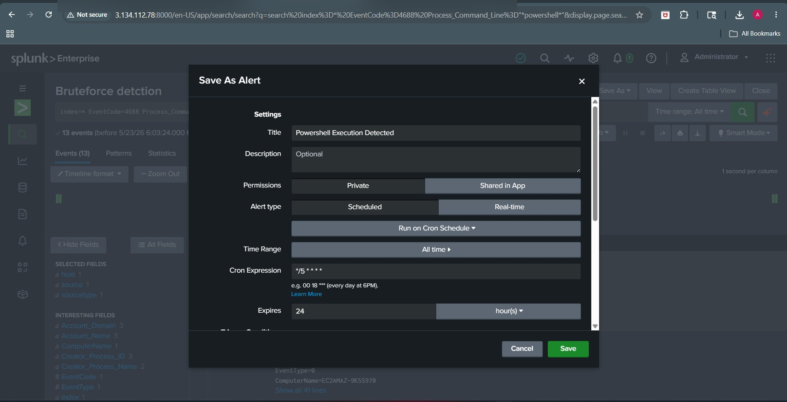
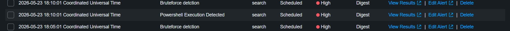

# ⚡ E2 — PowerShell Execution Detection (Event ID 4688)


---

## 🎯 Objective

Detect suspicious PowerShell execution.

---

## 🛠️ Attack Simulation

Executed PowerShell on the endpoint.

### 📸 Attack Evidence


---

## 🔍 Detection Query

```spl
index="*" EventCode=4688 New_Process_Name="*powershell*"
| table _time ComputerName Account_Name New_Process_Name Process_Command_Line
```

---

## 🚨 Alert

* Trigger: Any PowerShell execution

---








## 🧠 MITRE ATT&CK Mapping

| Field     | Value                                         |
| --------- | --------------------------------------------- |
| Tactic    | Execution                                     |
| Technique | Command and Scripting Interpreter: PowerShell |
| ID        | T1059.001                                     |

---

## ✅ Result

PowerShell execution detected successfully.
