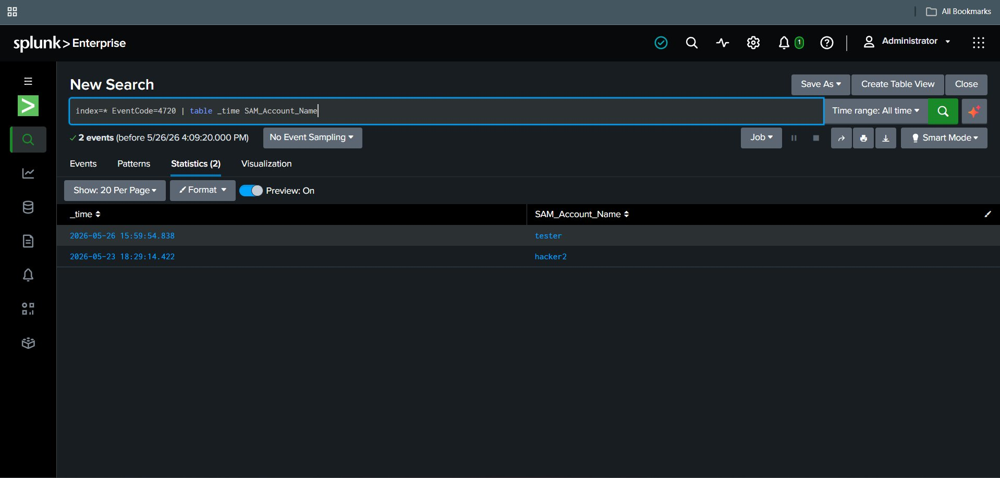
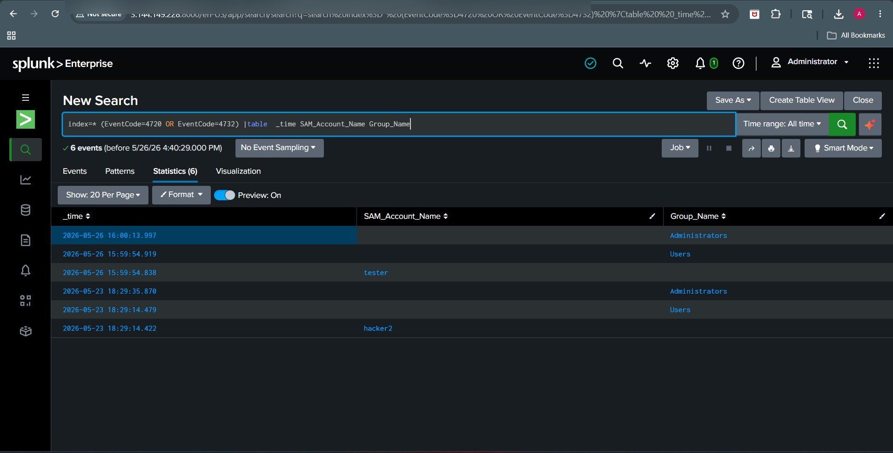
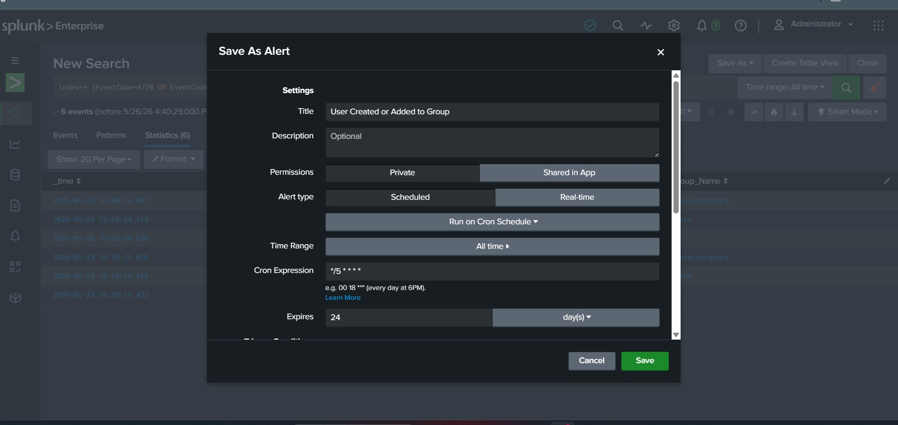
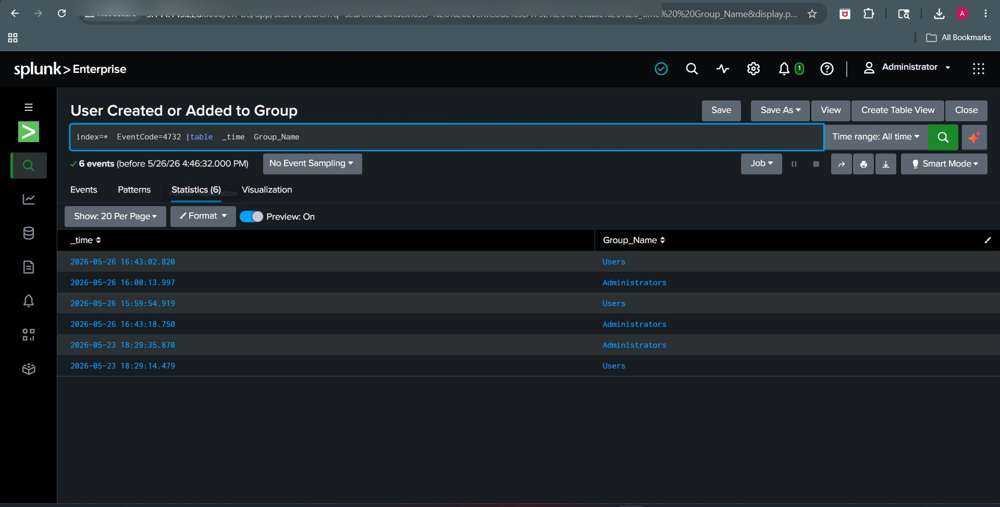
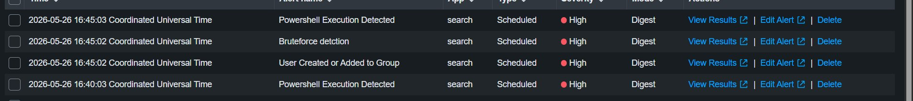

# 🔐 E3 — Privilege Escalation Detection (4720, 4732)


---

## 🎯 Objective

Detect unauthorized privilege escalation.

---

## 🛠️ Attack Simulation

1. Created new user (Event ID 4720)
2. Added user to Administrators group (Event ID 4732)

### 📸 Attack Evidence


---

## 🔍 Detection Query

```spl
index="*" (EventCode=4720 OR EventCode=4732)
| table _time EventCode Account_Name ComputerName
```

---

## 🚨 Alert

* Trigger: Any match

---










## 🧠 MITRE ATT&CK Mapping

| Field     | Value                |
| --------- | -------------------- |
| Tactic    | Privilege Escalation |
| Technique | Account Manipulation |
| ID        | T1098                |

---

## ✅ Result

Privilege escalation detected successfully.
