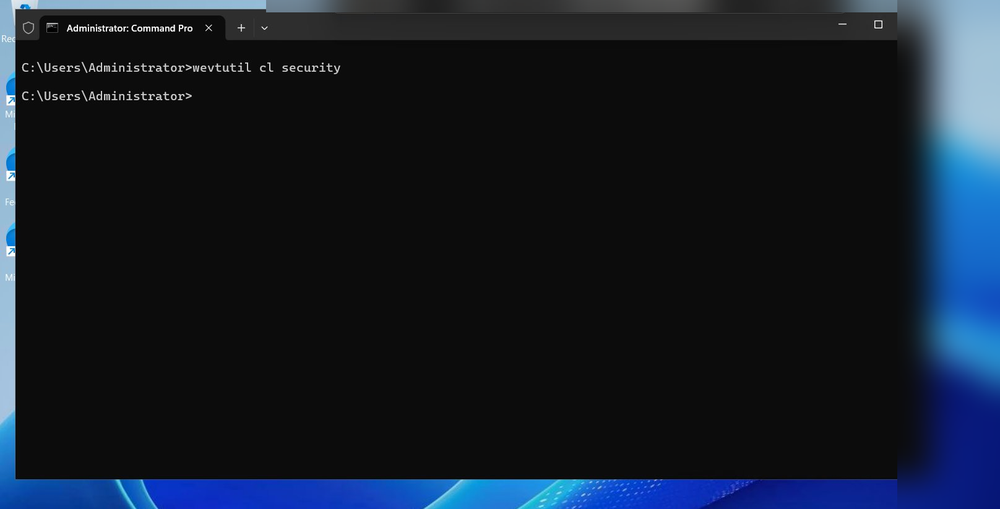
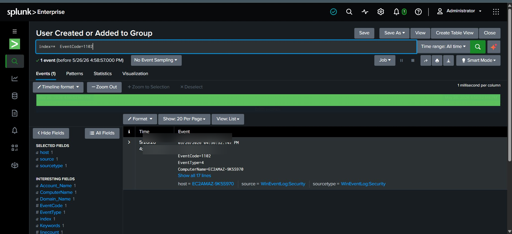
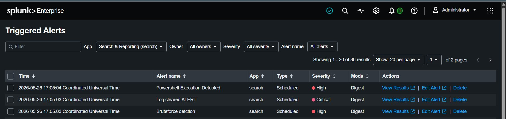

# 🧹 E4 — Log Clearing Detection (Event ID 1102)


---

## 🎯 Objective

Detect log clearing activity.

---

## 🛠️ Attack Simulation

```cmd
wevtutil cl security
```

### 📸 Attack Evidence



---

## 🔍 Detection Query

```spl
index="*" EventCode=1102
```

---

## 🚨 Alert Query

```spl
index="*" EventCode=1102
| table _time ComputerName
```






---

## 🧠 MITRE ATT&CK Mapping

| Field     | Value                     |
| --------- | ------------------------- |
| Tactic    | Defense Evasion           |
| Technique | Indicator Removal on Host |
| ID        | T1070.001                 |

---

## ✅ Result

Log clearing attack detected successfully.
